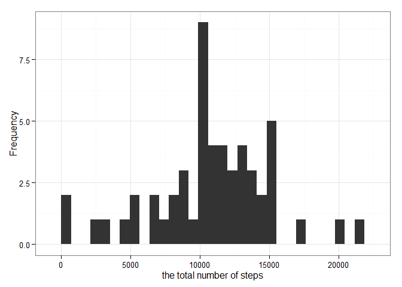
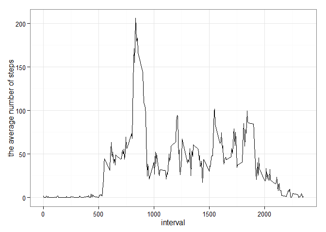
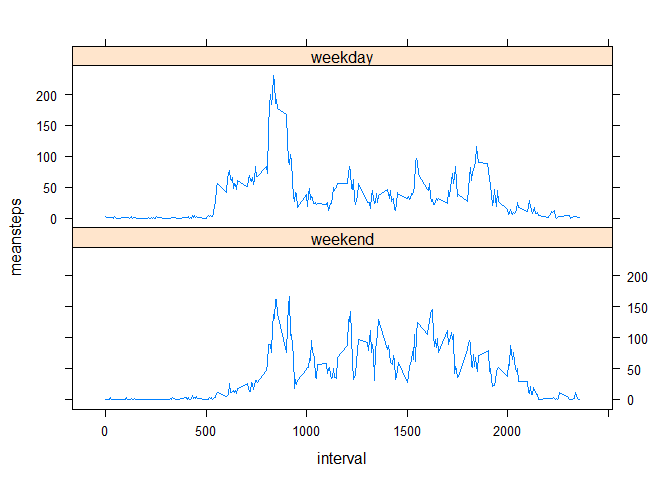

##1.What is mean total number of steps taken per day?
1. loading  the packages 

```r
library(plyr)
library(ggplot2)
library(lattice)
```

2.Calculate the total number of steps taken per day

```r
activity<-read.csv("E:/activity.csv")
activity$date<-as.Date(activity$date)
no_na<-activity[!is.na(activity$steps),]
total<-ddply(no_na,.(date),summarise,sum=sum(steps))
```

3.Make a histogram of the total number of steps taken each day

```r
ggplot(total,aes(x=sum))+geom_histogram()+xlab("the total number of steps")+ylab("Frequency")+theme_bw()
```

```
## stat_bin: binwidth defaulted to range/30. Use 'binwidth = x' to adjust this.
```

 

4.Calculate and report the mean and median of the total number of steps taken per day

```r
means<-ddply(no_na,.(date),summarise,mean=mean(steps))
medians<-ddply(no_na,.(date),summarise,median=median(steps))
```
##2.What is the average daily activity pattern?
1.Make a time series plot  of the 5-minute interval and the average number of steps taken, averaged across all days

```r
ave<-ddply(no_na,.(interval),summarise,mean=mean(steps))
ggplot(ave,aes(interval,mean))+geom_line()+ylab("the average number of steps")+theme_bw()
```

 

##3.Imputing missing values
1.Calculate and report the total number of missing values in the dataset (i.e. the total number of rows with NAs)

```r
Nanumsums<-sum(is.na(activity$steps))
```

2.use the mean for that 5-minute interval for filling in all of the missing values in the dataset

```r
na_data<-activity[is.na(activity$steps),]
new_data<-merge(na_data,ave,by="interval",all.x=TRUE)
new_data<-new_data[,-2]
names(new_data)<-c("interval","date","steps")
new_activity<-rbind(no_na,new_data[,c(3,2,1)])
new_activity<-new_activity[order(new_activity$date),]
```

3.Make a histogram of the total number of steps taken each day 

```r
new_total<-ddply(new_activity,.(date),summarise,sum=sum(steps))
```

4.Calculate the mean and median total number of steps taken per day

```r
new_means<-ddply(new_activity,.(date),summarise,mean=mean(steps))
new_medians<-ddply(new_activity,.(date),summarise,median=median(steps))
```
##4.Are there differences in activity patterns between weekdays and weekends?
1.Create a new factor variable in the dataset with two levels – “weekday” and “weekend” 

```r
new_activity$weekwd<-0
a<-c("星期六","星期日")
new_activity[!weekdays(new_activity$date) %in% a,]$weekwd="weekday"
new_activity[weekdays(new_activity$date) %in% a,]$weekwd="weekend"
```

2.plot a time series plot  of the 5-minute interval and the average number of steps taken, averaged across all weekday days or weekend days 

```r
interval_weekwd<-ddply(new_activity,.(interval,weekwd),summarise,meansteps=mean(steps))
xyplot(meansteps~interval|weekwd,data=interval_weekwd,type="l",layout=c(1,2),as.table=TRUE)
```

 


