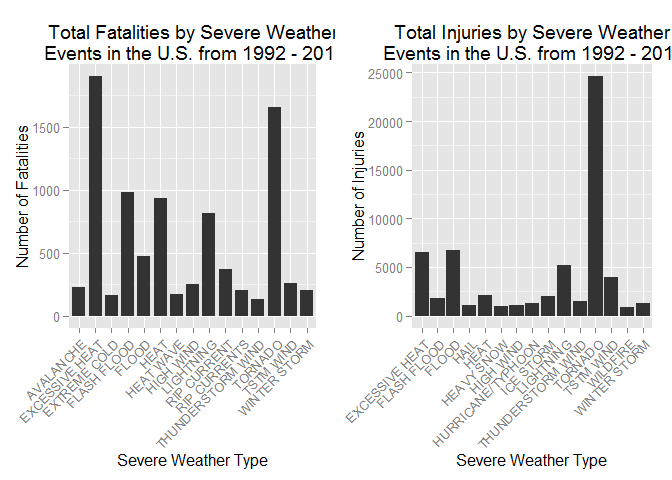

# The damage of different weather events on public health and economy
###Abstract:
    we analyze the impact of different weather events on public health and economy in the report. We use the four attributes of fatalities, injuries, property and crop damage to estate which types of event are most harmful to the population health and economy, on the basis of analysis,we can conclude that excessive heat and tornado are more harmful to population health, and flood, drought, and hurricane/typhoon have the worst economic consequences.


```r
 #set the directory and  require  the packages 
setwd("E:/")  
library(data.table)
library(ggplot2)
library(gridExtra)
```


```r
#get the origin datasets and manipulate
data<-fread("data.csv")
```

```
## Warning in fread("data.csv"): Read less rows (902297) than were allocated
## (967216). Run again with verbose=TRUE and please report.
```


```r
data$year <- as.numeric(format(as.Date(data$BGN_DATE, format = "%m/%d/%Y %H:%M:%S"), "%Y"))
ggplot(data,aes(year))+geom_histogram()   #show the counts of years
```

```
## stat_bin: binwidth defaulted to range/30. Use 'binwidth = x' to adjust this.
```

```
## Warning: position_stack requires constant width: output may be incorrect
```

 


```r
# get the selected datasets we use
year<-as.data.frame(table(data$year))
year$cum<-cumsum(year$Freq)
year
```

```
##    Var1  Freq    cum
## 1  1950   223    223
## 2  1951   269    492
## 3  1952   272    764
## 4  1953   492   1256
## 5  1954   609   1865
## 6  1955  1413   3278
## 7  1956  1703   4981
## 8  1957  2184   7165
## 9  1958  2213   9378
## 10 1959  1813  11191
## 11 1960  1945  13136
## 12 1961  2246  15382
## 13 1962  2389  17771
## 14 1963  1968  19739
## 15 1964  2348  22087
## 16 1965  2855  24942
## 17 1966  2388  27330
## 18 1967  2688  30018
## 19 1968  3312  33330
## 20 1969  2926  36256
## 21 1970  3215  39471
## 22 1971  3471  42942
## 23 1972  2168  45110
## 24 1973  4463  49573
## 25 1974  5386  54959
## 26 1975  4975  59934
## 27 1976  3768  63702
## 28 1977  3728  67430
## 29 1978  3657  71087
## 30 1979  4279  75366
## 31 1980  6146  81512
## 32 1981  4517  86029
## 33 1982  7132  93161
## 34 1983  8322 101483
## 35 1984  7335 108818
## 36 1985  7979 116797
## 37 1986  8726 125523
## 38 1987  7367 132890
## 39 1988  7257 140147
## 40 1989 10410 150557
## 41 1990 10946 161503
## 42 1991 12522 174025
## 43 1992 13534 187559
## 44 1993 12607 200166
## 45 1994 20631 220797
## 46 1995 27970 248767
## 47 1996 32270 281037
## 48 1997 28680 309717
## 49 1998 38128 347845
## 50 1999 31289 379134
## 51 2000 34471 413605
## 52 2001 34962 448567
## 53 2002 36293 484860
## 54 2003 39752 524612
## 55 2004 39363 563975
## 56 2005 39184 603159
## 57 2006 44034 647193
## 58 2007 43289 690482
## 59 2008 55663 746145
## 60 2009 45817 791962
## 61 2010 48161 840123
## 62 2011 62174 902297
```

```r
dim(data)[1]*0.8  #to compare with the cum attributes in the year 
```

```
## [1] 721837.6
```

```r
storm<-data[data$year>=1992,]   #after comparing ,we use the data after 1992,the datasets of storm is what we use next,its class is  also data.table
```


```r
#the Fatalities by Severe Weather  from 1992 to 2011
fata<-storm[,list(all.fata=sum(FATALITIES)),by=EVTYPE]
fata<-as.data.frame(fata)
fata_top15<-fata[order(fata$all.fata,decreasing =T),][1:15,]
fata_top15
```

```
##                EVTYPE all.fata
## 99     EXCESSIVE HEAT     1903
## 2             TORNADO     1660
## 20        FLASH FLOOD      978
## 27               HEAT      937
## 15          LIGHTNING      816
## 36              FLOOD      470
## 18        RIP CURRENT      368
## 1           TSTM WIND      255
## 46          HIGH WIND      248
## 73          AVALANCHE      224
## 8        WINTER STORM      206
## 443      RIP CURRENTS      204
## 182         HEAT WAVE      172
## 43       EXTREME COLD      160
## 16  THUNDERSTORM WIND      133
```

```r
p1<-ggplot(fata_top15, aes(x=EVTYPE, y=all.fata)) + 
    geom_bar(stat ="identity",width=0.8)+ 
    theme(axis.text.x = element_text(angle = 45, hjust = 1)) + 
    xlab("Severe Weather Type") + ylab("Number of Fatalities") + 
    ggtitle("Total Fatalities by Severe Weather\n Events in the U.S. from 1992 - 2011")
```


```r
#the Injuries by Severe Weather  from 1992 to 2011
inj<-storm[,list(all.inj=sum(INJURIES)),by=EVTYPE]
inj<-as.data.frame(inj)
inj_top15<-inj[order(inj$all.inj,decreasing =T),][1:15,]
inj_top15
```

```
##                EVTYPE all.inj
## 2             TORNADO   24633
## 36              FLOOD    6789
## 99     EXCESSIVE HEAT    6525
## 15          LIGHTNING    5230
## 1           TSTM WIND    3954
## 27               HEAT    2100
## 65          ICE STORM    1975
## 20        FLASH FLOOD    1777
## 16  THUNDERSTORM WIND    1488
## 8        WINTER STORM    1321
## 973 HURRICANE/TYPHOON    1275
## 46          HIGH WIND    1137
## 3                HAIL    1068
## 53         HEAVY SNOW    1021
## 221          WILDFIRE     911
```

```r
p2<-ggplot(inj_top15, aes(x=EVTYPE, y=all.inj)) + 
    geom_bar(stat ="identity",width=0.9)+ 
    theme(axis.text.x = element_text(angle = 45, hjust = 1)) + 
    xlab("Severe Weather Type") + ylab("Number of Injuries") + 
    ggtitle("Total Injuries by Severe Weather\n Events in the U.S. from 1992 - 2011")
```


```r
grid.arrange(p1,p2,ncol=2)
```

 


```r
#the Property damage by Severe Weather  from 1992 to 2011
a<-c("EVTYPE","PROPDMG","PROPDMGEXP","CROPDMG","CROPDMGEXP")
storm<-as.data.frame(storm)
data2<-storm[,names(storm) %in% a]
data2[data2$PROPDMGEXP=="",]$PROPDMGEXP=0
data2[tolower(data2$PROPDMGEXP)=="h",]$PROPDMGEXP=2
data2[tolower(data2$PROPDMGEXP)=="k",]$PROPDMGEXP=3
data2[tolower(data2$PROPDMGEXP)=="m",]$PROPDMGEXP=6
data2[tolower(data2$PROPDMGEXP)=="b",]$PROPDMGEXP=9
data2$PROPDMGEXP<-as.numeric(data2$PROPDMGEXP)
```

```
## Warning: NAs introduced by coercion
```

```r
data2<-data2[complete.cases(data2),]
data2$PRO<-data2$PROPDMG*10^(data2$PROPDMGEXP)
data2<-as.data.table(data2)

pro<-data2[,list(all.pro=sum(PRO)),by=EVTYPE]
pro<-as.data.frame(pro)
pro_top15<-pro[order(pro$all.pro,decreasing =T),][1:15,]
pro_top15
```

```
##                EVTYPE      all.pro
## 36              FLOOD 144657709807
## 971 HURRICANE/TYPHOON  69305840000
## 202       STORM SURGE  43323536000
## 2             TORNADO  27755870947
## 20        FLASH FLOOD  16822673979
## 3                HAIL  15735267513
## 224         HURRICANE  11868319010
## 207    TROPICAL STORM   7703890550
## 8        WINTER STORM   6688497251
## 46          HIGH WIND   5270046260
## 51        RIVER FLOOD   5118945500
## 219          WILDFIRE   4765114000
## 974  STORM SURGE/TIDE   4641188000
## 1           TSTM WIND   4484928495
## 64          ICE STORM   3944927860
```

```r
p3<-ggplot(pro_top15, aes(x=EVTYPE, y=all.pro)) + 
    geom_bar(stat ="identity",width=0.9)+ 
    theme(axis.text.x = element_text(angle = 45, hjust = 1)) + 
    xlab("Severe Weather Type") + ylab("Number of Property damage") + 
    ggtitle("Total Property damage by Severe Weather\n Events in the U.S. from 1992 - 2011")
```


```r
#the crop damage by Severe Weather  from 1992 to 2011
a<-c("EVTYPE","PROPDMG","PROPDMGEXP","CROPDMG","CROPDMGEXP")
storm<-as.data.frame(storm)
data3<-storm[,names(storm) %in% a]
data3[data3$CROPDMGEXP=="",]$CROPDMGEXP=0
data3[tolower(data3$CROPDMGEXP)=="k",]$CROPDMGEXP=3
data3[tolower(data3$CROPDMGEXP)=="m",]$CROPDMGEXP=6
data3[tolower(data3$CROPDMGEXP)=="b",]$CROPDMGEXP=9
data3$CROPDMGEXP<-as.numeric(data3$CROPDMGEXP)
```

```
## Warning: NAs introduced by coercion
```

```r
data3<-data3[complete.cases(data3),]
data3$crop<-data3$CROPDMG*10^(data3$CROPDMGEXP)
data3<-as.data.table(data3)

crop<-data3[,list(all.crop=sum(crop)),by=EVTYPE]
crop<-as.data.frame(crop)
crop_top15<-crop[order(crop$all.crop,decreasing =T),][1:15,]
crop_top15
```

```
##                EVTYPE    all.crop
## 193           DROUGHT 13972566000
## 36              FLOOD  5661968450
## 52        RIVER FLOOD  5029459000
## 65          ICE STORM  5022113500
## 3                HAIL  3025954473
## 225         HURRICANE  2741910000
## 972 HURRICANE/TYPHOON  2607872800
## 20        FLASH FLOOD  1421317100
## 43       EXTREME COLD  1292973000
## 959      FROST/FREEZE  1094086000
## 14         HEAVY RAIN   733399800
## 208    TROPICAL STORM   678346000
## 46          HIGH WIND   638571300
## 1           TSTM WIND   554007350
## 99     EXCESSIVE HEAT   492402000
```

```r
p4<-ggplot(crop_top15, aes(x=EVTYPE, y=all.crop)) + 
    geom_bar(stat ="identity",width=0.9)+ 
    theme(axis.text.x = element_text(angle = 45, hjust = 1)) + 
    xlab("Severe Weather Type") + ylab("Number of Crop damage") + 
    ggtitle("Total Crop damage by Severe Weather\n Events in the U.S. from 1992 - 2011")
```


```r
grid.arrange(p3,p4,ncol=2)
```

 
